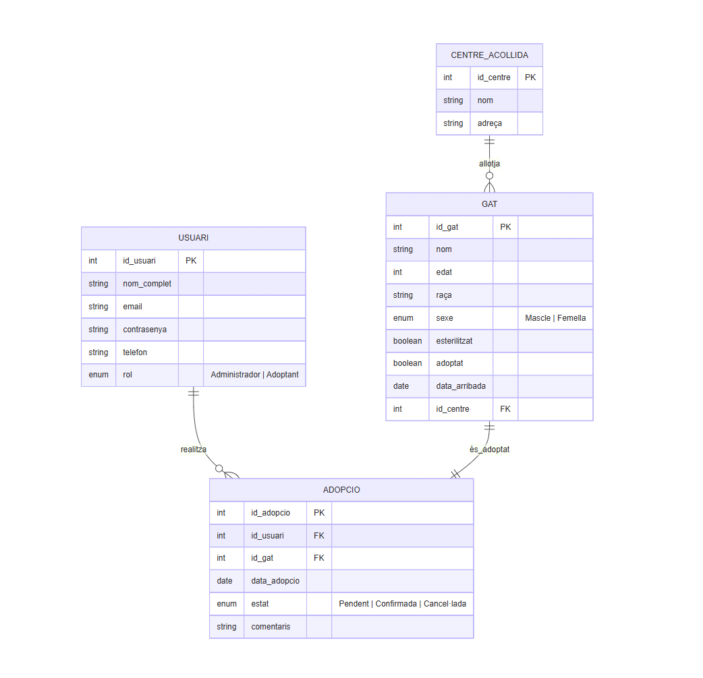
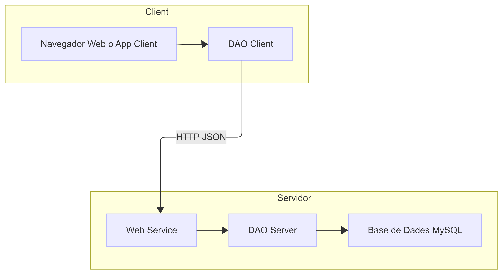
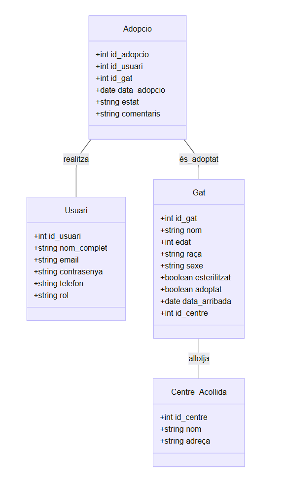
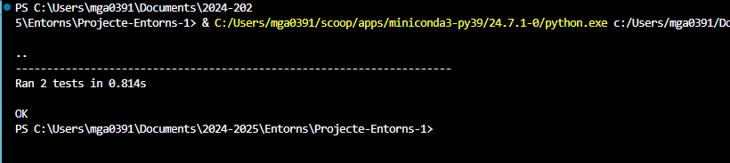

# Projecte DAM1 Entorns Desenvolupament "Adopta un Gatito 🐾" - Mini sistema de adopcions de mascotes

## - Descripció del Projecte

L'aplicació Adopta un Gatito és una eina digital dissenyada per facilitar i gestionar el procés d’adopció de gats de manera senzilla i accessible. Està pensada per a refugis, protectores i persones voluntàries que vulguin gestionar els animals disponibles per a l’adopció, així com per a usuaris interessats en donar una nova llar a un gat.

### Funcionalitats principals
 - Consulta de gats disponibles: els usuaris poden visualitzar un llistat de gats que actualment estan disponibles per a ser adoptats, amb informació detallada com el nom, l’edat, el sexe, la descripció i una imatge representativa.

 - Afegir nous gats: els administradors poden registrar nous gats al sistema mitjançant un formulari, incloent-hi les seves característiques i estat d’adopció.

 - Gestió d’adopcions: els usuaris poden sol·licitar l’adopció d’un gat. El sistema permet al personal responsable validar, rebutjar o confirmar aquestes sol·licituds, mantenint un registre d’adopcions realitzades.

 - Gestió d’usuaris: el sistema inclou funcionalitats bàsiques d’autenticació i autorització. Els rols principals són:

    - Visitants: poden consultar el catàleg de gats.

    - Usuaris registrats: poden iniciar sessió i sol·licitar adopcions.

    - Administradors: poden afegir o eliminar gats i gestionar les adopcions.

### Arquitectura tècnica
L’aplicació està basada en una arquitectura client-servidor:

 - Backend:

    - Desenvolupat en Python utilitzant Flask o FastAPI per oferir serveis web RESTful.

    - S'encarrega de la lògica de negoci, la validació de dades i la persistència a la base de dades.

    - Connecta amb una base de dades MySQL, on s'emmagatzemen les dades dels gats, usuaris i adopcions.

- Frontend:

    - Feta en terminal, amb possibilitat d'ampliació utilitzant HTML, CSS i JavaScript.

    - Permet a l’usuari interactuar amb les funcionalitats del sistema.

## - Requeriments Tècnics

Requeriments Backend, Frontend, generals, d'infraestructura i del procés de desenvolupament.

[req-tecnics.md](req-tecnics.md)

## - Planificació de tasques i assignació al GitHub 

https://github.com/users/lauragrr1/projects/10 

## - Model E/R

## - BBDD Mysql

En local PHPMyAdmin

## - Diagrama d'arquitectura Client / Servidor

## - Descripció dels End-points del WebService

| Mètode  |	Endpoint  |	Funció  |
| -------- | -------- | -------- | 
| GET  |	/gats  |	Llistar gats disponibles |
| POST |	/gats	| Afegir un nou gat |
| PUT	| /adoptar/<id>	 |Marcar un gat com adoptat |
| POST	 | /login	 |Login d'usuari |

## - Diagrama de classes del Backend

## - Diagrama de classes del Frontend

## - Diagrama de seqüència del Login
Usuari
  |
  |---> [1] Introdueix usuari i contrasenya
  |
Frontend (HTML + JS)
  |
  |---> [2] POST /login amb credencials -----------> Backend (Flask)
  |                                                |
  |                                                |---> [3] SELECT * FROM usuaris WHERE nom = ? AND contrasenya = ? ---> BBDD (MySQL)
  |                                                |
  |                                                |<--- [4] Resultat: credencials vàlides o no
  |                                                |
  |<--- [5] 200 OK + token  o  401 Unauthorized ---|
  |
  |---> [6] Si OK → desa token + redirigeix a menú
  |       Si KO → mostra error a l’usuari
  |
Usuari veu resultat

## - Wireframes del Login i les següents pantalles (mínim 1)

Pantalla inicial

.png>)

## - Tests unitaris de la part programada

[Codi Test Unitaris](App/test_app.py)

