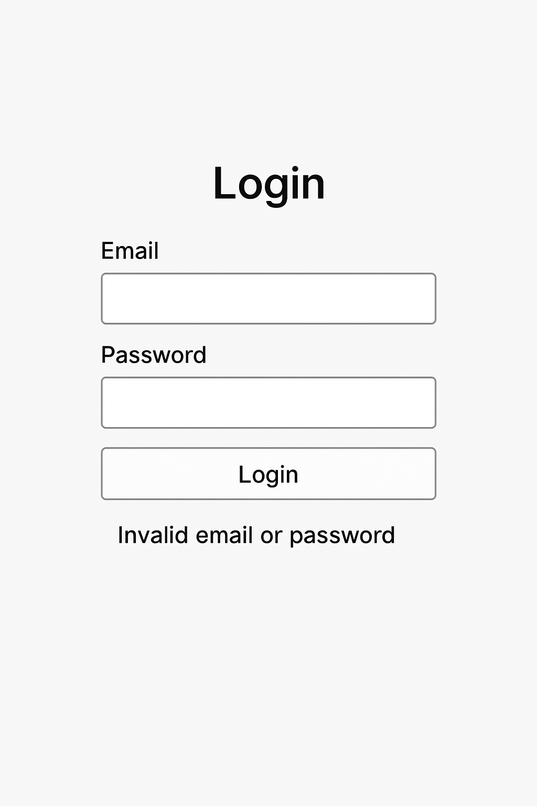

# Projecte DAM1 Entorns Desenvolupament "Adopta un gatito" - Mini sistema de adopcions de mascotes

- Descripció del Projecte a fer.

Aplicació per gestionar l'adopció de gats. Els usuaris poden veure els gats disponibles, afegir-ne de nous i gestionar adopcions. El sistema disposa d’un backend en Python amb accés a una base de dades MySQL i una interfície web senzilla per interactuar-hi.

- Requeriments tècnics

[Requeriments Tècnics](req-tecnics.md)

- Planificació de tasques i assignació al GitHub 

https://github.com/users/lauragrr1/projects/10 

- Model E/R

- BBDD Mysql

[Script BBDD](script.txt)

- Diagrama d'arquitectura Client / Servidor

- Descripció dels End-points del WebService

| Mètode  |	Endpoint  |	Funció  |
| -------- | -------- | -------- | 
| GET  |	/gats  |	Llistar gats disponibles |
| POST |	/gats	| Afegir un nou gat |
| PUT	| /adoptar/<id>	 |Marcar un gat com adoptat |
| POST	 | /login	 |Login d'usuari |

- Diagrama de classes del Backend

- Diagrama de classes del Frontend

- 

- 1 cas d'ús detallat a escollir

(Afegir gat)

- Diagrama de seqüència del Login

Usuari → Client Web → POST /login → Backend → MySQL
                             ← token / error

- Wireframes del Login i les següents pantalles (mínim 1)

Pantalla inicial

- Desenvolupament d'una part petita.
- Tests unitaris de la part programada
