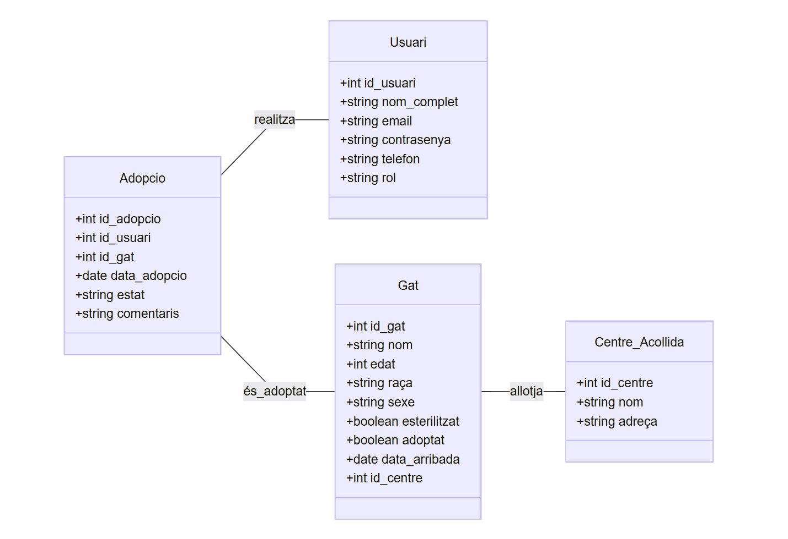
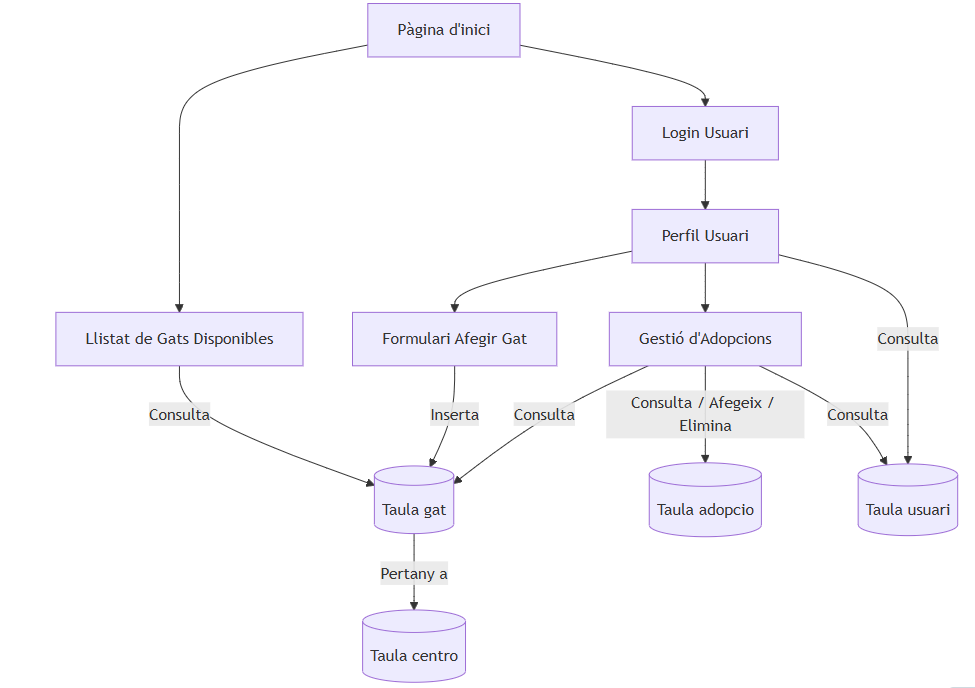

# Projecte DAM1 Entorns Desenvolupament "Adopta un gatito" - Mini sistema de adopcions de mascotes

- Descripció del Projecte a fer.

Aplicació per gestionar l'adopció de gats. Els usuaris poden veure els gats disponibles, afegir-ne de nous i gestionar adopcions. El sistema disposa d’un backend en Python amb accés a una base de dades MySQL i una interfície web senzilla per interactuar-hi.

- Requeriments tècnics
## 1. Backend (Servidor i Gestió de Dades)
El backend és el cor del sistema, encarregat de gestionar les adopcions, usuaris, gats disponibles, reserves, i tota la lògica de negoci.

### a. Requisits del servidor
 - Allotjament: Hosting compartit o servidor VPS (segons escalabilitat necessària)
 - Base de dades: MySQL
 - Sistema operatiu del servidor: Linux
 - APIs i serveis web: API REST desenvolupada amb Flask o FastAPI

### b. Llenguatges de programació

Python 3.x

### c. Seguretat
 - Autenticació i autorització d'usuaris
 - Xifrat de dades sensibles (ex: contrasenyes amb hashing segur com bcrypt o SHA-256)
 - Comunicació segura via HTTPS
 - Còpies de seguretat automatitzades de la base de dades

Validació d’entrades per prevenir vulnerabilitats (ex: SQL Injection)

## 2. Frontend
### a. Tipus de clients
 - Interfície basada en wireframes
 - Possibilitat d’ampliació amb interfície web (HTML, CSS, JavaScript)
 - Compatible amb navegadors moderns (Chrome, Firefox, Edge)

### b. Compatibilitat
 - Dispositius d’escriptori (Windows, Linux, Mac)
 - Possibilitat futura d’extensió a dispositius mòbils amb framework com Flutter

## 3. Requisits Generals
### a. Gestió d’usuari i autenticació
 - Rols d’usuari: Visitant, Usuari registrat, Administrador
 - Autenticació per usuari o correu + contrasenya
 - Possibilitat d’autenticació per token (JWT)
 - Contrasenyes emmagatzemades amb hashing (no MD5)

### b. Emmagatzematge local i sincronització
 - Al navegador: token d’autenticació, id d’usuari, preferències bàsiques
 - Comunicació segura via HTTPS

### c. Accessibilitat
 - Compliment del nivell AA de les directrius WCAG 2.1
 - Navegació compatible amb teclat
 - Text alternatiu per imatges de gats

## 4. Requisits d’Infraestructura
 - Xarxa: Accés a internet estable
 - Emmagatzematge al núvol: espai suficient per imatges dels gats (p. ex. 1 GB)
 - APIs de tercers: opcional — per enviar notificacions, localització, etc.

## 5. Requisits del Procés de Desenvolupament
### a. Eines i entorns
 - IDE: Visual Studio Code
 - Extensions VSCode recomanades: Python, Python Snippets, REST Client
 - Entorn de desenvolupament: Miniconda3 o entorn virtual (venv)

### b. Control de versions
 - Git + GitHub
 - Organització en branques per funcionalitats

### c. Metodologia de treball
 - Desenvolupament àgil (Scrum o Kanban)
 - Validació iterativa amb usuaris (feedback dels usuaris adoptants)

### d. Proves de qualitat
 - Tests unitaris amb unittest o pytest

Cobertura de les principals funcionalitats (ex: creació d’usuari, sol·licitud d’adopció, llistat de gats disponibles)

- Planificació de tasques i assignació al GitHub 

https://github.com/users/lauragrr1/projects/10 

- Model E/R

- BBDD Mysql

[Script BBDD](script.txt)

- Diagrama d'arquitectura Client / Servidor

- Descripció dels End-points del WebService

| Mètode  |	Endpoint  |	Funció  |
| -------- | -------- | -------- | 
| GET  |	/gats  |	Llistar gats disponibles |
| POST |	/gats	| Afegir un nou gat |
| PUT	| /adoptar/<id>	 |Marcar un gat com adoptat |
| POST	 | /login	 |Login d'usuari |

- Diagrama de classes del Backend

- Diagrama de classes del Frontend

- 

- 1 cas d'ús detallat a escollir

(Afegir gat)

- Diagrama de seqüència del Login

Usuari → Client Web → POST /login → Backend → MySQL
                             ← token / error

- Wireframes del Login i les següents pantalles (mínim 1)

Pantalla inicial

- Desenvolupament d'una part petita.
- Tests unitaris de la part programada
